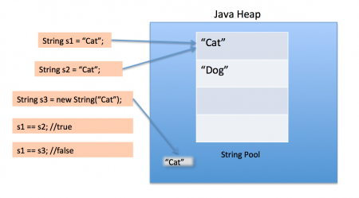

# new String()과 ""의 차이는 무엇인가요?

- `new String()`과 `""`의 차이는 생성한 문자열의 메모리 관리 방식이 다르다.
- `new String()`은 **새로운 객체를 생성**하고, 메모리 관리가 필요하며, GC에 의해 메모리가 관리된다.
- `""`은 이미 정의된 문자열 객체를 참조하므로, 새로운 객체를 생성하지 않는다.
- 그래서 `new String()`보다 `""`가 메모리 효율이 높고, 속도가 빠르다.

> `String`은 다른 객체들에 비해 광범위하고, 빈번하게 사용되므로 `String`을 사용할 때마다 객체를 생성하는 방식으로 사용하게 된다면, 새로운 객체를
> 계속 만들어내는 것이기 때문에 메모리 관리 측면에서 비효율적이다. 
> 이러한 `String`을 효율적으로 관리하기 위해, Heap 메모리 영역 속에 **String Pool**을 만들었다.
> 
> 
> - **String Pool**은 문자열을 생성하는 데 더 많은 시간이 걸리더라도 Java Runtime을 위한 많은 공간을 절약하는 데 도움이 된다.
> - `""`를 사용하여 문자열을 생성할 때 먼저 **String Pool**에서 동일한 값을 문자열을 찾는다.
> - 발견하면 참조만 반환하고 그렇지 않으면 풀에 새 문자열을 생성한 다음 참조를 반환한다.
> - 그러나 `new` 연산자를 사용하면 `String` 클래스가 Heap 공간에 새 `String` 객체를 생성하도록 강제한다.

 

### 참고
- [참고 사이트](https://www.digitalocean.com/community/tutorials/what-is-java-string-pool)