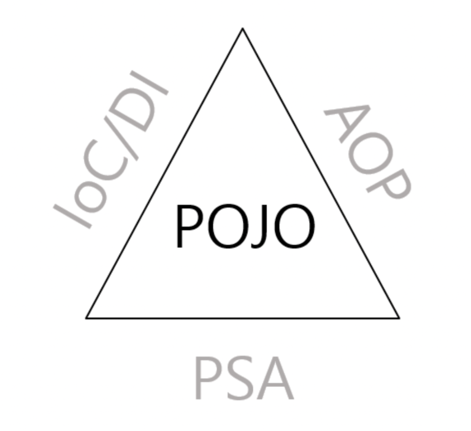

# Spring 이란 무엇인가요?

- 스프링 정의 : **엔터프라이즈용 Java 애플리케이션 개발을 편하게 할 수 있게 해주는 오픈소스 경량급 애플리케이션 프레임워크**
- 스프링은 하나의 기술이 아니라 스프링 데이터, 스프링 세션, 스프링 시큐리티 등과 같은 **스프링 프로젝트들의 모음**이다.
- 스프링은 자바 언어 기반의 [프레임워크](https://github.com/genesis12345678/TIL/blob/main/interview/programming/Framework_Library.md#%ED%94%84%EB%A0%88%EC%9E%84%EC%9B%8C%ED%81%AC%EC%99%80-%EB%9D%BC%EC%9D%B4%EB%B8%8C%EB%9F%AC%EB%A6%AC%EC%9D%98-%EC%B0%A8%EC%9D%B4%EC%A0%90%EC%97%90-%EB%8C%80%ED%95%B4-%EC%84%A4%EB%AA%85%ED%95%B4-%EC%A3%BC%EC%84%B8%EC%9A%94)이며, 자바 언어의 가장 큰 특징은 **객체 지향 언어**이다.
- **스프링은 객체 지향 언어가 가진 강력한 특징을 살려내도록 하여 좋은 객체 지향 애플리케이션을 개발할 수 있게 도와주는 프레임워크다.**

# 스프링의 특징

- 스프링의 가장 큰 특징은 **POJO 프로그래밍을 지향한다**는 것이다.
- **POJO** : `Plain Old Java Object`, **순수 Java만을 통해서 생성한 객체**
  - 어떤 객체가 외부 라이브러리나 외부의 모듈을 가져와서 사용하고 있다면, 그 객체는 `POJO`라고 할 수 없다.
- `POJO`가 아닌 객체는 특정 기술이나 환경에 종속적이게 되어 유연한 변화와 확장에 대처할 수 없다.
- 하지만 `POJO`는 순수 Java만을 사용하여 만든 객체이므로 특정 기술이나 환경에 종속되지 않는다.
  - **외부 기술이나 변화에 얽매이지 않아, 보다 유연하게 변화와 확장에 대처할 수 있다.**
  - 이런 `POJO`를 사용하여 비즈니스 로직을 구현하면 **객체지향 설계를 제한없이 적용할 수 있으며, 코드가 단순해져 테스트와 디버깅 또한 쉬워진다.**

**스프링은 POJO 프로그래밍을 위해 `IoC/DI`, `AOP`, `PSA`라는 기술을 제공한다.**

## IoC/DI

- **Inversion Of Control / Dependency Injection**, 제어의 역전 / 의존성 주입
- Java는 객체지향 언어이므로, 객체들 간의 관계를 적절히 맺어주는 것이 중요한 요소 중 하나다.
- 객체들 간의 관계를 맺어준다는 것은, `A` 인스턴스가 `B` 인스턴스의 메서드를 호출하고 있다면 `A`는 `B`와 의존 관계를 맺은 것이 되며, "A가 B에 의존하는 관계"라고 표현할 수 있다.
- 하지만 `A`에서 `B`를 생성하는 직접적인 코드가 있으면 향후 변경이 발생했을 때 대처가 어렵다.
- 유연한 변경이 가능하게 하기 위해서는 누군가 `A`가 사용할 객체를 결정하고 생성해서 `A`가 인스턴화될 때 인자로 전달해주어야만 한다.
- 여기서 누군가는 **스프링**이고, **개발자가 아닌 스프링이 `A`가 사용할 객체를 생성하여 의존관계를 맺어주는 것을 `IoC`라 하며, 그 과정에서 외부 객체를 `A`의 생성자 등을 통해
  주입해주는 것을 `DI`라고 한다.**

## AOP

- **Aspect Oriented Programming**, 관점 지향 프로그래밍
- 애플리케이션을 개발할 때 구현해야 하는 기능들은 크게 **핵심 기능**과 **부가 기능**으로 나눌 수 있다. 
- **핵심 기능**은 애플리케이션의 핵심 기능과 관련된 사항으로, 해당 객체가 제공하는 고유의 기능이다.
- **부가 기능**은 모든 핵심 기능에 공통적으로 적용되는 관심 사항들로, 핵심 기능을 보조하기 위해 제공되는 기능이다.(로깅, 보안 등)
- 이때, 핵심 기능과 부가 기능이 함께 있으면 **부가 기능** 관련 코드가 중복될 수밖에 없다. 만약 **부가 기능**을 수행하는 로직이 변경되면 모든 중복 코드를 찾아서 일일이 수정해야 할 것이다.
- 애플리케이션 전반에 걸쳐 적용되는 공통 기능을 **횡단 관심사**로 보고, 비즈니스 로직으로부터 분리해내는 것을 **AOP**라고 한다.

## PSA

- **Portable Service Abstraction**, 일관된 서비스 추상화
- 스프링을 사용하면 데이터베이스가 변경되어도 동일한 사용방법을 유지한 채로 바꿀 수 있다.
- 이는 **스프링이 데이터베이스 서비스를 추상화한 인터페이스를 제공해주기 때문이다.**
- 스프링은 Java를 사용하여 데이터베이스에 접근하는 방법을 규정한 인터페이스를 제공하는데, 이를 [JDBC](https://github.com/genesis12345678/TIL/blob/main/Spring/database_1/jdbc/jdbc.md)라고 한다.
- 이처럼 **특정 기술과 관련된 서비스를 추상화하여 일관된 방식으로 사용될 수 있도록 한 것을 PSA라고 한다.**

 

### 참고
- [참고 사이트](https://www.codestates.com/blog/content/%EC%8A%A4%ED%94%84%EB%A7%81-%EC%8A%A4%ED%94%84%EB%A7%81%EB%B6%80%ED%8A%B8)
- [참고 동영상](https://www.youtube.com/watch?v=YdE4krx0dsM)