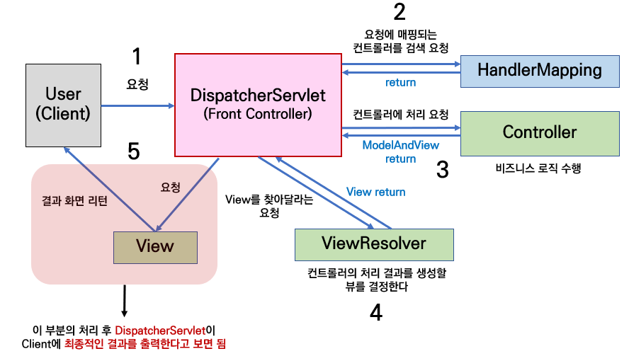
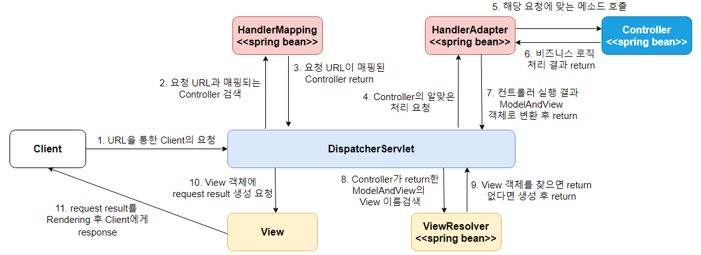

# 스프링 MVC 구조에 대해 설명해 주세요.

### HandlerMapping
- 요청을 처리할 핸들러(컨트롤러)를 찾는 역할(인터페이스)
- `getHandler()`메서드 를 통해 요청된 URL에 매핑되는 핸들러(컨트롤러)를 찾아서 반환한다.
- `RequestMappingHandlerMapping`이 구현체이며, 이 구현체는 `@RequestMapping` 애노테이션이 붙어있는 컨트롤러 메서드를 모두 스캔해서
    해당 메서드와 URL 간의 매핑 정보를 관리한다.

### HandlerAdaptor

- `HandlerMapping`을 통해 찾은 핸들러(컨트롤러)의 실제 로직을 수행하는 역할(인터페이스)
- **이러한 어댑터를 사용해 핸들러의 종류에 상관 없이 다양한 종류의 핸들러를 실행할 수 있다.**
- `supports()` 메서드로 핸들러 어댑터가 파라미터로 들어온 핸들러를 지원하는지에 대한 여부를 반환한다.
- `handle()` 메서드로 실제 핸들러 로직을 수행한다.

### ViewResolver

- 반환된 `View` 이름을 실제 View 객체로 변환하는 역할(인터페이스)
- 위에 `HandlerAdaptor`의 `handle()` 메서드는 `ModelAndView`라는 객체를 반환한다.
  - `ModelAndView` : 컨트롤러에서 처리한 데이터(모델)와 해당 데이터를 표시할 `View`의 정보를 가진 객체
- 이제 `ViewResolver`는 `resolveViewName()` 메서드를 통해 `View` 이름을 가지고 실제 `View` 객체를 찾아서 반환한다.

### DispatcherServlet

- 사용자의 요청을 가장 처음 받는 곳(프론트 컨트롤러)으로 내부에 `HandlerMapping`, `HandlerAdpator`, `ViewResolver`를 모두 가지고 있다.
- `DispatcherServlet`의 핵심 메서드인 `doDispatch()`는 다음과 같은 과정으로 동작한다.
1. 핸들러 조회
2. 핸들러 어댑터 조회
3. 핸들러 어댑터 실행
4. 핸들러 어댑터는 실제 핸들러를 실행
5. 핸들러 어댑터는 핸들러가 반환하는 정보를 `ModelAndView`로 변환해서 반환 
6. 뷰 리졸버를 통해 반환된 뷰 이름에 해당하는 뷰를 조회
7. 뷰 렌더링

## Spring MVC 전체 동작 흐름

1. **요청**
   - 클라이언트로부터 요청이 오면 이 요청은 **프론트 컨트롤러**인 `DispatcherSerlvet`에게 전달된다.
2. **HandlerMapping**
   - `DispatcherServlet`은 `HandlerMapping`에게 요청을 어떤 컨트롤러에 보낼지에 대한 매핑 정보를 요청한다.
3. **HandlerAdaptor**
   - `HandlerMapping`이 찾은 컨트롤러를 받아 컨트롤러의 실제 로직을 수행한다.
4. **Controller**
   - 컨트롤러는 비즈니스 로직을 수행하고, 필요한 데이터를 모델에 담는다.
5. **HandlerAdaptor**
   - 컨트롤러에서 받은 정보를 `ModelAndView` 객체로 변환해서 `DispatcherServlet` 에게 전달한다.
6. **ViewResolver**
   - `DispatcherServlet`에게 받은 `ModelAndView`의 뷰 이름을 가지고 실제 `View` 객체를 찾아서 다시 `DispatcherServlet`에게 전달한다.
7. **View**
   - `ViewResolver`를 통해 찾은 뷰는 모델의 담긴 데이터를 이용해서 클라이언트에게 보여줄 최종 결과물을 생성한다.
8. **응답**
   - `DispatcherServlet`은 생성된 뷰를 클라이언트에게 응답하고 요청을 마친다.

 

### 참고
- [참고 동영상](https://www.youtube.com/watch?v=3gmOuUWPZV4&t=931s)
- [참고 블로그](https://velog.io/@dydaks7878/%EC%8A%A4%ED%94%84%EB%A7%81-MVC-%ED%95%B5%EC%8B%AC-%EA%B5%AC%EC%84%B1-%EC%9A%94%EC%86%8C)
- [참고 블로그](https://velog.io/@choidongkuen/Spring-MVC-%ED%8C%A8%ED%84%B4%EC%97%90-%EB%8C%80%ED%95%B4-%EC%95%8C%EC%95%84%EB%B4%85%EC%8B%9C%EB%8B%A4)