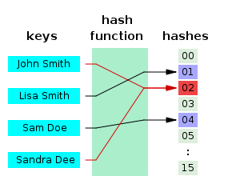
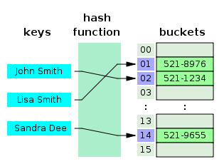
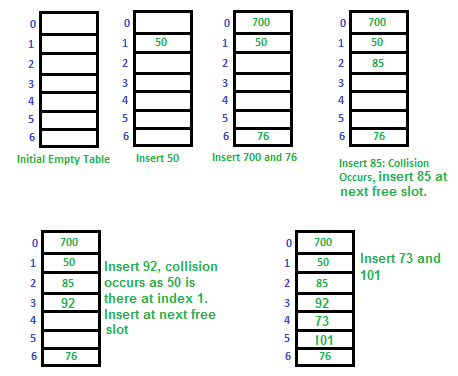
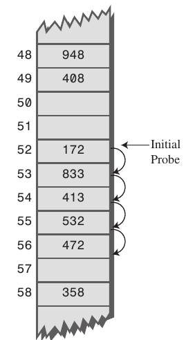

# 자료 구조

 
 

### 해시(Hash)

---

> - **해시함수(hash function)** : 데이터의 효율적 관리를 목적으로 임의의 길이의 데이터를 **고정된 길이**의 데이터로 매핑하는 함수이다.
>
> - **키(key)** : 매핑 전 원래 데이터의 값
>
> - **해시값(hash value)** : 매핑 후 데이터의 값
>
> - **해싱(hashing)** : 매핑하는 과정 자체

해시함수는 해시값의 개수보다 많은 키값을 해시값으로 변환하기 때문에(ManyToOne) 해시함수가 서로 다른 두 개의 키에 대해 동일한 해시값을 내는 **해시충돌(collistion)** 이 발생하게 된다.

그림처럼 'John Smith'와 'Sandra Dee'가 모두 02로 매핑돼 해시충돌을 일으키고 있다.

**그럼에도 해시 테이블을 쓰는 이유는**

> 적은 리소스(자원)로 많은 데이터를 효율적으로 관리할 수 있다. 해시 함수로 하드디스크나 클라우드에 존재하는 무한에 가까운 데이터들을 유한한 개수의 해시값으로 매핑함으로써 작은 크기의 캐시 메모리로도 프로세스를 관리할 수 있게 된다.

**색인(Index)** 에 해시값을 사용함으로써 모든 데이터를 살피지 않고도 검색과 삽입, 삭제를 빠르게 수행할 수 있다.

해시함수는 **언제나 동일한 해시값을 리턴**하고, 해당 색인만 알면 해시테이블의 크기에 상관없이 데이터에 빠르게 접근 가능하며, 색인은 계산이 간단한 함수(상수시간)으로 작동하기 때문에 매우 효율적이다.

**즉 해시테이블은 삽입, 삭제, 탐색시 시간복잡도가 O(1)이다.**

 

### 해시 테이블

---

> 해시 함수를 사용하여 키를 해시값으로 매핑하고, 이 해시값을 색인 혹은 주소 삼아 데이터의 값을 키와 함께 저장하는 자료구조를 **해시 테이블**이라고 한다.  
> 이 때 데이터가 저장되는 곳을 **버킷(bucket) 또는 슬롯(slot)** 이라고 한다.

예시 그림 같은 경우 버킷에 다음과 같이 데이터가 저장된다.

| index(hash value) | data                   |
| ----------------- | ---------------------- |
| 01                | (Lisa Smith, 521-8976) |
| 02                | (John Smith, 521-1234) |
| 14                | (Sandra Dee, 521-9655) |

 
 
 

### 해시충돌 문제 해결방안

---

1. **chaining**

- 한 버킷당 들어갈 수 있는 엔트리의 수에 제한을 두지 않음으로써 모든 자료를 헤시테이블에 담는다.
- 만약 해당 버킷에 데이터가 이미 있다면 체인처럼 노드를 추가하여 다음 노드를 가리키는 방식으로(연결리스트) 구현한다.
- 유연하다는 장점이 있으나 메모리 문제가 있다.

  

  위 그림처럼 'John Smith'와 'Sandra Dee'를 같은 해시값(152)로 매핑하고 있다. 이 경우 해당 해시값에 대응하는 동일한 버킷에 두 개 데이터를 저장해 둔다. 
  그림처럼 연결리스트로 저장할 경우 최근 데이터는 연결리스트의 head에 추가한다.

 
 

2. **open addressing**

- chaining과 달리 한 버킷당 들어갈 수 있는 엔트리가 하나뿐인 헤시테이블이다. 해시함수로 얻은 주소가 아닌, 다른 주소에 데이터를 저장할 수 있도록 한다.
- 메모리 문제는 발생하지 않으나 **해시충돌이 생길 수 있다.**

open addressing의 예로 해시함수를 `키값을 7로 나눈 나머지`라고 정의하고 키 50, 700, 76, 85, 92, 73, 101 순으로 데이터를 저장한다고 해보자.

85부터 살펴보면 85를 7로 나눈 나머지는 1이다. 그런데 해시값 1에 해당하는 버킷에 이미 50이 있으므로 다음 버킷(2)에 저장해 둔다. 92를 7로 나눈 나머지 역시 1이다. 그래서 다음 버킷(2)에 저장하려 했으나 역시 이미 85가 존재하므로 92를 3번 버킷에 저장한다. 73과 101역시 자신의 버킷에는 이미 주인이 있으므로 빈 버킷에 할당한다.

> open addressing은 구조상 해시충돌 문제가 발생할 수 있다. 
> 특정 해시값에 키가 몰리게 되면 효율성이 크게 떨어진다.  
> 삽입, 삭제, 탐색을 수행하기 위해 해시테이블 내 새로운 주소(해시값)를 찾는 과정인 **탐사방식**으로 해결할 수 있다.

 
 

### 선형 탐사

---

- 최초 해시값에 해당하는 버킷에 다른 데이터가 저장돼 있으면 해당 해시값에서 고정폭을 옮겨 다음 해시값에 해당하는 버킷에 액세스(삽입, 삭제, 탐색)한다. 여기에 데이터가 있으면 고정폭으로 또 옮겨 액세스한다.

하지만 탐사 이동폭이 고정돼 있는 선형탐사는 특정 해시값 주변 버킷이 모두 채워져 있는 `primary clustring` 문제에 취약하다.
그림처럼 최초 해시값이 52인 상태에서 52~56까지 데이터가 모두 저장돼 있다면 탐사를 네 번 수행하고 나서야 원하는 위치를 찾을 수 있게 된다.

 
 

### 제곱 탐사

---

- 고정 폭으로 이동하는 선형 탐사와 달리 그 폭이 제곱수로 늘어난다는 특징이 있다.
  임의의 키 값에 해당하는 데이터에 액세스 할 때 충돌이 일어나면 1²칸을 옮긴다. 여기에서도 충돌이 일어난다면 2²칸, 3²칸 옮기는 식이다.

하지만 제곱탐사는 여러 개의 서로 다른 키들이 동일한 초기 해시값(Initial Probe)을 갖는 `secondary clustering`에 취약하다.  
초기 해시값이 같으면 다음 탐사 위치 또한 동일하기 때문에 효율성이 떨어진다. 아래 그림처럼 초기 해시값이 7인 데이터를 삽입해야 할 경우 선형 탐사 기법보다 이동하는 범위가 넓더라도 탐사를 네 번 수행하고 나서야 데이터를 저장할 수 있다.

 
 

### 이중해싱

---

- 탐사할 해시값의 규칙성을 없애버려서 clustering을 방지하는 기법이다. 2개의 해시함수를 준비해서 하나는 최초의 해시값을 얻을 때 또 다른 하나는 해시충돌이 일어났을 때 탐사 이동폭을 얻기 위해 사용한다. 이렇게 되면 최초 해시값이 같더라도 탐사 이동폭이 달라지고, 탐사 이동폭이 같더라도 최초 해시값이 달라져 `primary, secondary clustering`을 모두 완화할 수 있다.
