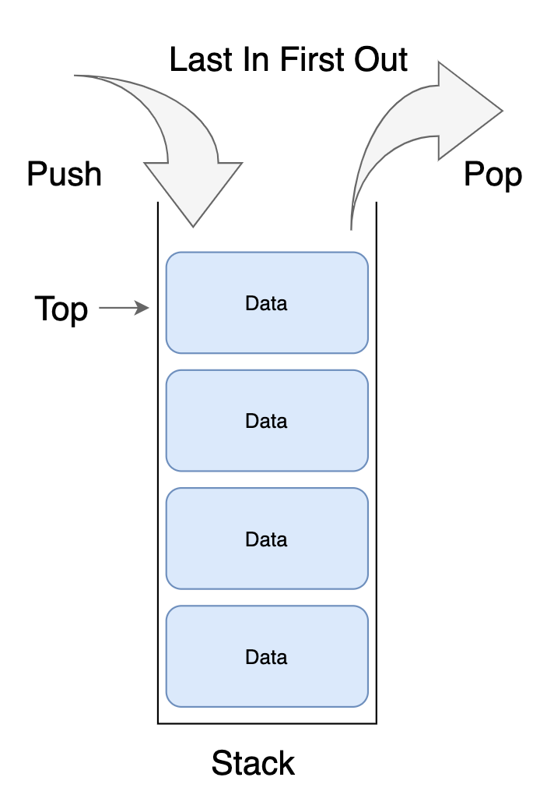

# 자료 구조

(2023.12.03)

### 알고리즘

---

> 어떤 문제를 해결하기 위해 사용되는 풀이과정. 즉 **문제해결방법**을 말한다.
>
> 여러가지 문제해결방법 중 **가장 효율이 좋은 방법**을 **어떤 문제에 대한 알고리즘**이라고 한다.

<br>
<br>

### 시간 복잡도 점근 표기법

---

> **시간복잡도** : 입력값과 문제를 해결하는 데 걸리는 시간을 **함수 관계**로 나타낸 것.
> 즉 실행시간을 기준으로, 알고리즘이 **얼마나 효율적인 지**를 판단할 수 있는 척도이다.

- 최상의 경우 : 오메가 표기법(Big-Ω Notation)
- 평균의 경우 : 세타 표기법(Big-θ Notation)
- **최악의 경우 : 빅오 표기법(Big-O Notation)**

알고리즘을 구할 때는 항상 최악의 경우를 생각해서 구해야 하기 때문에 보통 빅오 표기법을 많이 사용한다.

<br>
<br>

### 배열(Array)의 탐색/삽입/삭제 연산 시간복잡도

---

- 탐색 연산 : O(N)
- 삽입 연산 : O(1)
- 삭제 연산 : O(N)

<br>
<br>

### 연결리스트(Linked List)

---

> 데이터 하나를 **노드(node)라는 객체로 정의**하고, 이 노드의 연결을 정의한 구조.
>
> 노드를 저장할 때 **그 다음 순서의 자료가 있는 위치**를 데이터에 포함시키는 방식으로 자료를 저장한다. 시작(head)과 끝(tail)이 존재하며 모양으로 비유하면 비엔나 소시지가 된다.

<br>


- 탐색 시간복잡도 : O(N)
- 삽입 시간복잡도 : O(1)
- 삭제 시간복잡도 : O(1)

<br>

### 큐(Queue)

---


> FIFO : **First In First Out**
>
> **선입선출** 구조를 띄며, 티켓팅 하기 위해 줄을 서는 사람들이라고 생각하면 된다.
>
> 데이터가 들어오는 위치는 가장 뒤(Rear 또는 Back)에 있고, 데이터가 나가는 위치는 가장 앞(Front)에 있어서 먼저 들어오는 데이터는 가장 먼저 나가게 된다.
>
> 입력 동작은 **Enqueue**, 출력 동작은 **Dequeue**라고 한다.

<br>

### 스택(Stack)

---



> LIFO : **Last In First Out**
>
> **후입선출** 구조를 띄며, 입력 동작은 **push**, 출력 동작은 **pop**라고 한다.

- **콜 스택(Call Stack)**

  - **호출 스택**이라고도 하며, 여러 함수들을 호출하는 스크립트에서 해당 위치를 추적하는 인터프리터를 위한 메커니즘이다. 현재 어떤 함수가 실행중인지, 그 함수 내에서 어떤 함수가 호출되어야 하는지 등을 제어한다.

- **콜 스택 원리**

  1. 스크립트가 함수를 호출하면, 이를 호출 스택에 추가한 다음 함수를 실행하기 시작한다.
  2. 해당 함수에 의해 호출되는 모든 함수는 호출 스택에 추가되고 호출이 도달하는 위치에서 실행한다.
  3. 현재 함수가 끝나면, 인터프리터는 스택을 제거하고 호출 스택 마지막 코드 목록에서 중단된 실행을 다시 시작한다.
  4. 스택이 할당된 공간보다 많은 공간을 차지하면, **stack overflow** 에러가 발생한다.

#### 예제

---

```

   function greeting() {

   sayHi();
   }

   function sayHi() {

   return "Hi!";
   }

   greeting();
   // 그 외 코드들

```

1. greeting() 함수에 도달할 때까지 모든 함수를 무시한다.
2. greeting() 함수를 호출 스택 리스트에 추가한다.

   ‣ 호출 스택 리스트 : greeting

3. greeting 함수 내부의 모든 코드를 실행한다.
4. sayHi() 함수를 호출한다.
5. sayHi() 함수를 호출 스택 리스트에 추가한다.

   ‣ 호출 스택 리스트 : sayHi - greeting

6. sayHi() 함수의 끝에 도달할 때까지, 함수 내부의 모든 코드를 실행한다.
7. sayHi()가 호출된 라인으로 돌아와 greeting() 함수의 나머지를 계속 실행한다.
8. 호출 스택 리스트에서 sayHi() 함수를 제거한다.

   ‣ 호출 스택 리스트 : greeting

9. greeting() 함수 내부의 모든 코드가 실행되었을 때, 이를 호출한 라인으로 돌아와 그 외 코드들이 계속 실행한다.
10. 호출 스택 리스트에서 greeting() 함수를 제거한다.

    ‣ 호출 스택 리스트 : EMPTY

<br>

### 덱(Deque)

---


> 양쪽 끝에서 삽입과 삭제가 모두 가능한 자료 구조의 한 형태이다.
>
> 두 개의 포인터를 사용하여 양쪽에서 삭제와 삽입을 발생시킬 수 있다.

<br>
<br>
<br>
<br>
<br>

## 정리

- **큐 Queue**

  - **FIFO(First In First Out)** 방식으로 동작하며 데이터가 삽입되는 곳을 `rear`, 데이터가 제거되는 곳을 `front`라 한다.
  - 데이터를 삭제하기 전에는 큐가 `empty`한지, 데이터를 추가하기 전에는 큐가 `full`인지 확인 후 진행해야 한다.
  - **시간 복잡도**

    - 삽입, 삭제 : O(1)
    - 탐색 : O(N)

<br>

- **스택 Stack**

  - **LIFO(Last In First Out)** 방식으로 동작한다.
  - 한 쪽 끝에서만 자료를 넣고 빼는 작업이 이루어지고 가장 최근에 스택에 삽입된 자료의 위치를 `top`이라 한다.
  - `push`로 새로운 데이터를 추가하고, `pop`로 가장 최근에 삽입된 데이터를 스택에서 삭제한다.
  - `top`이 아닌 위치의 데이터에 대한 접근, 삽입, 삭제는 모두 불가능하다.
  - 스택이 비어있을 때 `pop`을 시도하는 것을 `stack underflow`라 하고 스택의 크기가 비어있을 때 **push**를 시도하면 **stack overflow**가 발생한다.
  - **시간 복잡도**

    - 삽입, 삭제 : O(1)
    - 탐색 : O(N)

<br>

- **덱 Deque**

  - 큐와 스택의 기능을 모두 가지고 있고 `front, rear`에서 삽입과 삭제가 모두 가능한 자료구조이다.
  - **연속적인 메모리**를 기반으로 하고 선언 이후 크기를 줄이거나 늘릴 수 있는 **가변적 크기**를 갖는다.
  - `index`를 통해 임의의 원소에 바로 접근이 가능하다.
  - 중간에 데이터가 삽입될 때 다른 요소들을 앞, 뒤로 밀 수 있으며 **앞, 뒤에서 삽입과 삭제**가 모두 가능하다.
  - **시간 복잡도**

    - 삽입, 삭제, 탐색 : O(1)
